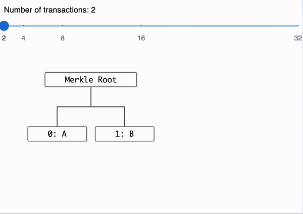

# Showcase Merkle Paths

A simple frontend application to visualise BSV Unified Merkle Paths (BUMP) and other Merkle Paths formats
for selected transactions on an example Merkle tree.

## Page

You can see this application there:
https://bitcoin-sv.github.io/showcase-merkle-paths/
